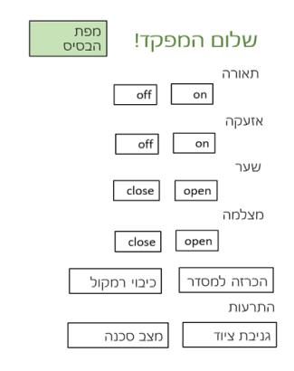
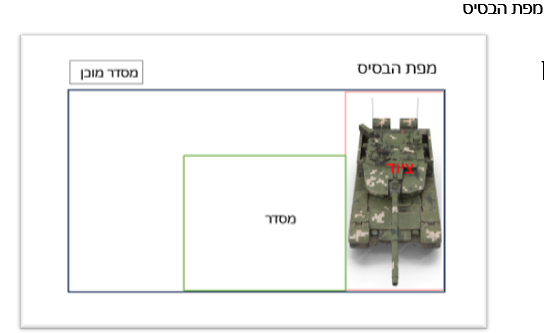
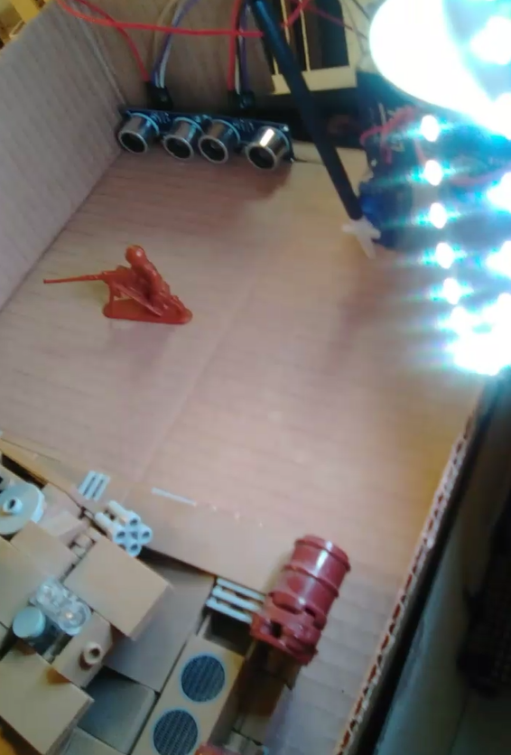
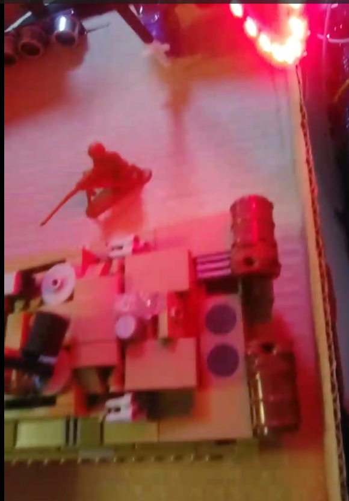

## Smart Military Base Management System using ESP32

Developed a smart military base monitoring system using ESP32 and C++, featuring real-time danger alerts.

##### for the full project process 👇👇

##### [Project book](https://drive.google.com/file/d/1s1mIrd-jn3SXPhV82BAf0Z0rtWOJd54j/view?usp=sharing)

## Project Overview
### Key Features

* Facial Recognition for Entry: Automatically controls base gate access for authorized personnel using the ESP32 camera.
* Hazard Detection: Monitors for dangerous conditions with flame and temperature sensors, triggering alarms and evacuation protocols.
* Theft Prevention: Detects and alerts on equipment   theft with real-time notifications and location tracking.
* Smart Lighting: Automates lighting based on soldier presence, with manual override via Wi-Fi.
* Remote Control: Enables remote management of gates, alarms, and surveillance through a web interface.

### Advantages
* Enhanced Security: Provides automated, real-time security monitoring and response.
* Operational Efficiency: Streamlines base operations with smart automation and remote control features.
* Scalable Design: Future upgrades can include advanced movement detection and image analysis for object recognition.
##### Below is the GUI in the project👇

##### in normal mode👇
##### in a state of danger💥💥

        

#### License
This code is proprietary and confidential. You are granted permission to view this code but not to copy, use, distribute, or modify it without explicit permission from the owner.
